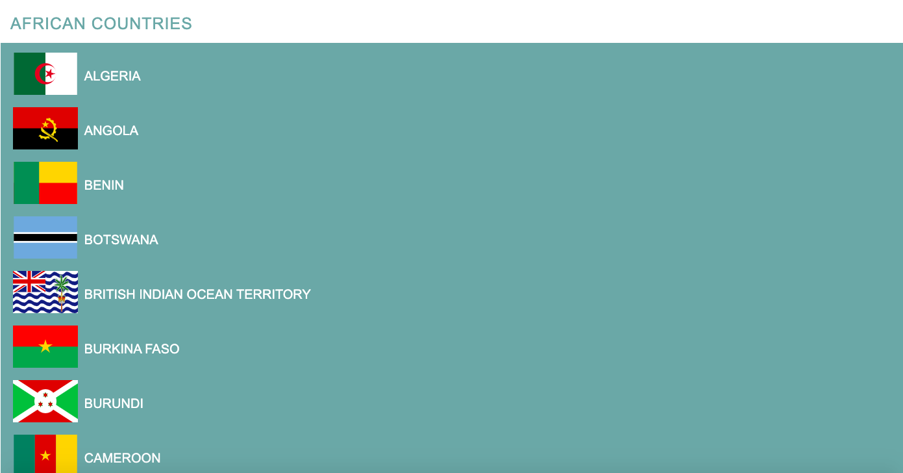
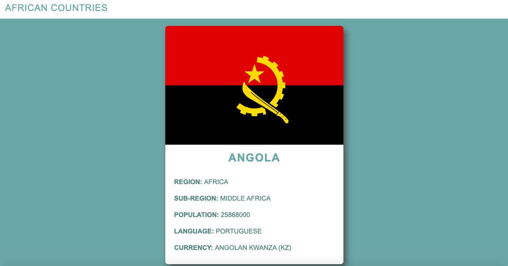

# Countries API - Next.js

## Description

This is a dynamic website that is created using data retrieved from the RestCountries API. The website displays the details of countries in the African Region. The web app was created using Next.js

Check out the [demo](https://restcountries-8084onzmm.vercel.app)

## Installation

Navigate to the project root folder, in your terminal type in `npm install`, once the node_modules are installed type in `npm run dev`.
Go to `http://localhost:3000`.

## Usage
### Landing Page
The landing page lists all the countries in the African Region. The user is able to click on a country to display the details of the selected country.

### Country Details Page
After selecting the country to view. The user is able to see all the relevant details about the country.

## Credits
Created by [@MelissaAppolis](https://github.com/MelissaAppolis)
